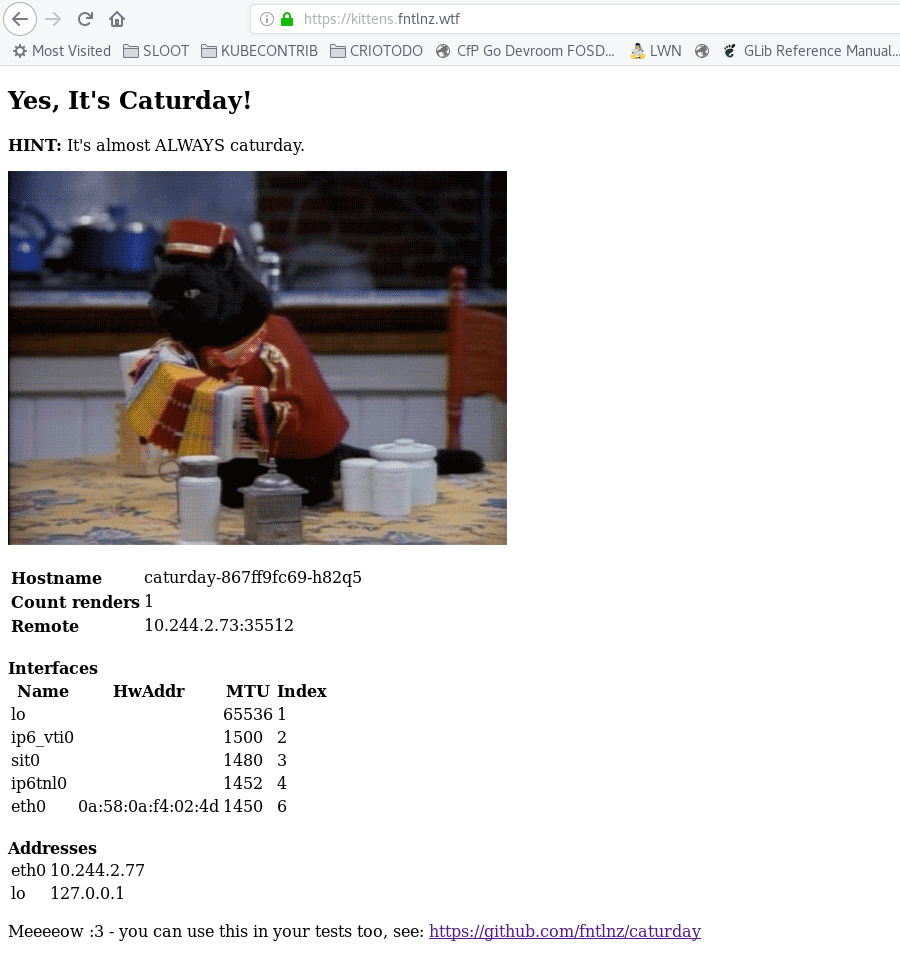

# Caturday

A lightweight web application I use to test container networking



## Usage with Kubernetes

As you can see in the following example, I provide a simple example using
caturday behind the kubernetes NGINX ingress and using kube-lego to obtain automatically
Let's Encrypt certificates.

I suggest you to edit the file if you want to use a custom domain (default: `kittens.local`)
or if your ingress is not `nginx` or you don'w want to automatically get certificates.

```
kubectl apply -f https://raw.githubusercontent.com/fntlnz/caturday/master/caturday.yml
```

## Usage with Red Hat OpenShift

First, create a new OpenShift project:

```
oc new-project caturday
```

I provide an [example set of OpenShift definitions](caturday-openshift) that
uses [`openshift-acme`](https://github.com/tnozicka/openshift-acme) to
automatically secure the route for the application. Edit it as needed, then
run:

```
oc create -f caturday-openshift.yml
```

## Usage with Docker

```
docker run -d fntlnz/caturday
```
